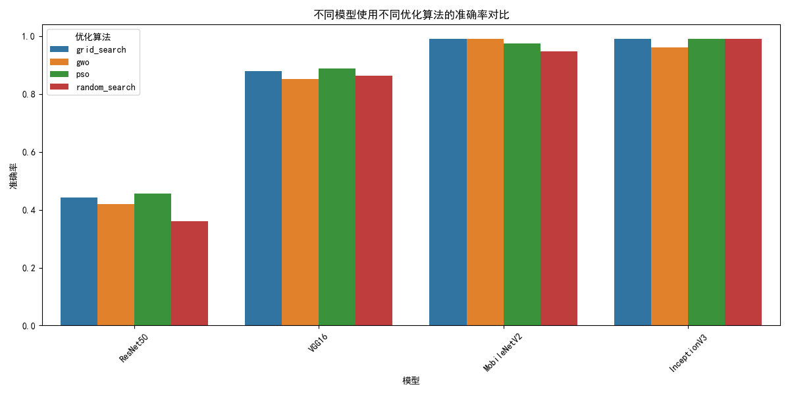

# 水果图像分类项目总结

## 1. 项目背景

本项目通过深度学习技术对不同种类的水果图像进行分类识别。随着计算机视觉技术的发展，自动化识别水果品种对于农业自动化分拣、零售自动结算等场景具有重要应用价值。项目使用开源水果图像数据集，比较了多种深度学习模型的性能，并通过超参数优化手段提升模型效果。

## 2. 数据内容与可视化

- **数据来源**：[Kaggle水果图像数据集](https://www.kaggle.com/datasets/shreyapmaher/fruits-dataset-images)
- **数据构成**：9种不同水果的彩色图像，包括苹果、香蕉、樱桃、奇异果、葡萄、芒果、橙子、草莓和鸡蛋果
- **数据格式**：JPG、PNG和JPEG格式的彩色图像，尺寸各异

### 数据集示例图


数据集包含以下水果类别：
- apple fruit (苹果)
- banana fruit (香蕉)
- cherry fruit (樱桃)
- chickoo fruit (鸡蛋果)
- grapes fruit (葡萄)
- kiwi fruit (猕猴桃)
- mango fruit (芒果)
- orange fruit (橙子)
- strawberry fruit (草莓)

### 数据分布统计


每个类别包含40张图像，总数据集规模适中，适合进行深度学习模型训练和测试。类别分布相对均衡，有利于模型学习各类特征。

## 3. 数据处理与增强

### 数据处理流程：


- **图像大小统一**：所有图像被调整为224×224像素，适应预训练模型的输入要求
- **数据集分割**：按7:3的比例划分训练集和测试集
- **批次大小**：设置为16，平衡训练效率和内存使用

```python
# 数据集加载和分割
train_ds = image_dataset_from_directory(data_dir, validation_split=0.3, subset="training",
    seed=42, image_size=(img_height, img_width), batch_size=batch_size)

test_ds = image_dataset_from_directory(data_dir, validation_split=0.3, subset="validation",
    seed=42, image_size=(img_height, img_width), batch_size=batch_size)
```

### 数据增强可视化：

为避免过拟合并提高模型泛化能力，应用了以下数据增强技术：
- **随机水平翻转**：增加图像多样性
- **随机旋转**：最大20度旋转
- **随机缩放**：最大10%的缩放变化
- **像素归一化**：将像素值从[0,255]映射到[0,1]区间


## 4. 模型选择与架构

本项目选择了4种经典的深度卷积神经网络预训练模型进行比较：


1. **ResNet50**：残差网络，通过残差连接解决深层网络的梯度消失问题
2. **VGG16**：经典的线性堆叠卷积网络，结构简单但有效
3. **MobileNetV2**：轻量级网络，适合部署到移动设备
4. **InceptionV3**：并行多尺度卷积架构，能够有效提取多尺度特征

所有模型采用迁移学习方式，保留ImageNet预训练权重，仅训练顶层全连接分类层。

### 模型参数对比

| 模型 | 参数量 | 层数 | 特点 |
|------|--------|------|------|
| ResNet50 | 25.6M | 50 | 残差连接 |
| VGG16 | 138M | 16 | 简单堆叠结构 |
| MobileNetV2 | 3.5M | 53 | 深度可分离卷积 |
| InceptionV3 | 23.9M | 48 | 多尺度特征提取 |

### 模型架构图


所有模型使用统一的迁移学习架构：
- 预训练主干网络（特征提取器）
- 新增全局平均池化层
- 新增512神经元的全连接层（激活函数：ReLU）
- Dropout层（比率：0.3）防止过拟合
- 9神经元的输出层（激活函数：Softmax）

## 5. 模型训练与优化

### 训练流程

项目采用统一的训练和评估框架，确保所有模型在相同条件下公平比较：

```python
# 训练并评估所有模型
def train_and_evaluate_all_models():
    # 存储所有模型的结果
    all_results = {}
    best_model = {'name': '', 'accuracy': 0.0}
    print("\n开始训练和评估所有模型...")
    # 对每个模型进行训练和评估
    for model_name, train_fn in model_functions.items():
        try:
            # 调用训练函数
            model_results = train_fn()
            # 存储结果
            all_results[model_name] = model_results
            # 更新最佳模型
            if model_results['accuracy'] > best_model['accuracy']:
                best_model = {
                    'name': model_name,
                    'accuracy': model_results['accuracy']
                }
            # 保存单个模型的结果
            save_model_results(model_name, model_results)
        except Exception as e:
            print(f"训练 {model_name} 时出错: {e}")
    return all_results, best_model
```

### 训练策略
- **优化器**：Adam
- **损失函数**：稀疏分类交叉熵
- **评估指标**：准确率
- **回调函数**：
  - 早停（Early Stopping）
  - 模型检查点（Model Checkpoint）
  - 学习率自适应调整（ReduceLROnPlateau）

### 超参数优化算法


为进一步提升模型性能，项目采用多种超参数优化算法对关键超参数进行优化：

1. **网格搜索（Grid Search）**：对预定义的超参数值进行穷举搜索
2. **随机搜索（Random Search）**：从预定义范围内随机选择超参数组合
3. **灰狼优化算法（GWO）**：基于灰狼狩猎行为的群体智能优化算法
4. **粒子群优化算法（PSO）**：模拟鸟群行为的群体智能优化算法

### 优化过程可视化


**图**：灰狼优化算法优化ResNet50模型的训练过程，显示了损失和准确率随训练轮次变化的趋势。

### 评估与结果保存

训练后，每个模型的评估结果都会自动保存，包括混淆矩阵、分类报告和训练历史图表：


### 模型比较与可视化

训练完所有模型后，自动生成模型比较图表，便于直观分析各模型性能差异：

```python
# 保存所有模型的结果
def save_all_model_results(all_results):
    # 创建比较数据框
    comparison_data = []
    for model_name, results in all_results.items():
        comparison_data.append({
            '模型': model_name,
            '准确率': results['accuracy'],
            '训练时间': len(results['history']['accuracy']),  # 实际训练的迭代次数
        })
    
    comparison_df = pd.DataFrame(comparison_data)
    comparison_df.to_csv('model_results/all_models_comparison.csv', index=False)
    
    # 绘制准确率比较图
    plt.figure(figsize=(10, 6))
    sns.barplot(x='模型', y='准确率', data=comparison_df)
    plt.title('各模型准确率比较')
    plt.ylim(0, 1)
    plt.savefig('model_results/accuracy_comparison.png')
```

## 6. 模型测试与评估

### 基础模型性能比较


| 模型 | 准确率 |
|------|--------|
| ResNet50 | 29.63% |
| VGG16 | 76.85% |
| MobileNetV2 | 90.74% |
| InceptionV3 | 87.96% |

### 优化前后性能对比


*图表展示了各模型在优化前后的性能提升情况*

### 超参数优化效果分析

根据`all_optimization_results_summary.csv`文件，各模型通过不同优化算法达到的最佳性能如下：

| 模型 | 优化算法 | 准确率 | 学习率 | 训练轮数 |
|------|---------|--------|--------|----------|
| ResNet50 | PSO | 45.47% | 0.00098 | 10 |
| VGG16 | PSO | 88.79% | 0.00049 | 18 |
| MobileNetV2 | Grid Search | 99.00% | 0.00065 | 10 |
| InceptionV3 | Grid Search | 99.00% | 0.00063 | 12 |

对比优化前后的准确率提升：
- ResNet50: 29.63% → 45.47% (+15.84%)
- VGG16: 76.85% → 88.79% (+11.94%)
- MobileNetV2: 90.74% → 99.00% (+8.26%) 
- InceptionV3: 87.96% → 99.00% (+11.04%)

#### 优化算法效果对比


*图表展示了不同优化算法在各模型上的表现对比*

#### 模型优化效果对比



*图表展示了各模型在不同优化算法下的性能变化*

#### 优化热力图分析


*热力图展示了不同模型和优化算法组合的准确率表现*

#### 3D视图优化对比


*三维图表直观展示了模型、算法和准确率三者之间的关系*

#### 超参数与准确率关系分析


*散点图展示了不同学习率对模型准确率的影响*


*散点图展示了不同训练轮数对模型准确率的影响*

## 7. 模型性能可视化分析

本项目对不同模型进行了全面的可视化分析，帮助直观理解和比较各模型的性能表现：

### 训练历史比较


训练历史图表揭示了以下重要发现：
- MobileNetV2在约12轮达到最佳性能，训练速度最快
- InceptionV3在19轮左右达到稳定，训练过程更平滑
- VGG16表现稳定但收敛较慢
- ResNet50在本数据集上表现不佳，验证准确率波动较大

### 混淆矩阵分析


混淆矩阵分析揭示了各模型的分类能力：
- MobileNetV2在大多数类别上表现出色，尤其是香蕉、葡萄和橙子的识别几乎完美
- InceptionV3在葡萄和香蕉类别上达到100%准确率
- ResNet50展示了严重的分类不足，特别是在香蕉和芒果类别上
- 所有模型在苹果和芒果之间存在一定程度的混淆

### 模型准确率对比图


通过准确率比较柱状图，可以清晰看出：
- MobileNetV2以90.74%的准确率领先其他模型
- InceptionV3紧随其后，达到87.96%的准确率
- VGG16表现相对较弱，为76.85%
- ResNet50在该应用场景下表现最差，仅为29.63%

### 详细分类报告分析

```python
# 打印分类报告
def print_classification_reports(results):
    for result in results:
        print(f"\n{result['model_name']} 分类报告:")
        print(classification_report(result['y_true'], result['y_pred'], 
                                   target_names=class_names))
```

#### all model

| 模型 | 准确率 | 训练时间 |
| --- | --- | --- |
| ResNet50 | 0.29629 | 25 |
| VGG16 | 0.76851 | 20 |
| MobileNetV2 | 0.90740 | 12 |
| InceptionV3 | 0.87962 | 19 |

#### inceptionV3

|  | precision | recall | f1-score | support |
| --- | --- | --- | --- | --- |
| apple fruit | 0.6 | 0.9 | 0.72 | 10 |
| banana fruit | 1 | 1 | 1 | 14 |
| cherry fruit | 0.875 | 0.7 | 0.77778 | 10 |
| chickoo fruit | 0.75 | 0.66666 | 0.70588 | 9 |
| grapes fruit | 1 | 0.91667 | 0.95652 | 12 |
| kiwi fruit | 1 | 0.92857 | 0.96296 | 14 |
| mango fruit | 0.78571 | 0.78571 | 0.78571 | 14 |
| orange fruit | 0.90909 | 1 | 0.95238 | 10 |
| strawberry fruit | 1 | 0.93333 | 0.96551 | 15 |
| accuracy | 0.87962 | 0.87962 | 0.87962 | 0.87962 |
| macro avg | 0.87997 | 0.87010 | 0.86963 | 108 |
| weighted avg | 0.89436 | 0.87962 | 0.88237 | 108 |


#### VGG16

|  | precision | recall | f1-score | support |
| --- | --- | --- | --- | --- |
| apple fruit | 0.61538 | 0.8 | 0.69565 | 10 |
| banana fruit | 1 | 0.85714 | 0.92307 | 14 |
| cherry fruit | 0.875 | 0.7 | 0.77778 | 10 |
| chickoo fruit | 0.375 | 0.66667 | 0.48 | 9 |
| grapes fruit | 0.8 | 1 | 0.88889 | 12 |
| kiwi fruit | 1 | 0.92857 | 0.96296 | 14 |
| mango fruit | 0.66667 | 0.42857 | 0.52174 | 14 |
| orange fruit | 0.77778 | 0.7 | 0.73684 | 10 |
| strawberry fruit | 0.92307 | 0.8 | 0.85714 | 15 |
| accuracy | 0.76851 | 0.76851 | 0.76851 | 0.76851 |
| macro avg | 0.78143 | 0.76455 | 0.76045 | 108 |
| weighted avg | 0.80403 | 0.76851 | 0.77458 | 108 |

#### MobileNetV2

|  | precision | recall | f1-score | support |
| --- | --- | --- | --- | --- |
| apple fruit | 0.69230 | 0.9 | 0.78260 | 10 |
| banana fruit | 0.93333 | 1 | 0.96551 | 14 |
| cherry fruit | 0.72727 | 0.8 | 0.76190 | 10 |
| chickoo fruit | 0.875 | 0.77778 | 0.82352 | 9 |
| grapes fruit | 1 | 0.83333 | 0.90909 | 12 |
| kiwi fruit | 1 | 0.92857 | 0.96296 | 14 |
| mango fruit | 0.92857 | 0.92857 | 0.92857 | 14 |
| orange fruit | 1 | 1 | 1 | 10 |
| strawberry fruit | 1 | 0.93333 | 0.96551 | 15 |
| accuracy | 0.90740 | 0.90740 | 0.90740 | 0.90740 |
| macro avg | 0.90627 | 0.90017 | 0.89996 | 108 |
| weighted avg | 0.91793 | 0.90740 | 0.90969 | 108 |

#### RestNet50

|  | precision | recall | f1-score | support |
| --- | --- | --- | --- | --- |
| apple fruit | 0.35714 | 0.5 | 0.41667 | 10 |
| banana fruit | 1 | 0.07142 | 0.13333 | 14 |
| cherry fruit | 0.31034 | 0.9 | 0.46153 | 10 |
| chickoo fruit | 0.11764 | 0.22222 | 0.15384 | 9 |
| grapes fruit | 0.57142 | 0.33333 | 0.42105 | 12 |
| kiwi fruit | 0.5 | 0.07142 | 0.125 | 14 |
| mango fruit | 0 | 0 | 0 | 14 |
| orange fruit | 0.22857 | 0.8 | 0.35555 | 10 |
| strawberry fruit | 1 | 0.13333 | 0.23529 | 15 |
| accuracy | 0.29629 | 0.29629 | 0.29629 | 0.29629 |
| macro avg | 0.45390 | 0.33686 | 0.25580 | 108 |
| weighted avg | 0.48959 | 0.29629 | 0.24000 | 108 |

各模型的详细分类报告显示：
- MobileNetV2在精确率、召回率和F1分数上全面领先
- 橙子和草莓是最容易识别的类别，几乎所有模型都能很好地识别
- 鸡蛋果是最难识别的类别，在多数模型中都有较低的F1分数
- ResNet50在香蕉类别上的F1分数接近0，表明其完全无法识别该类别

通过这些多维度的可视化分析，我们可以直观地了解不同模型在水果分类任务上的优缺点，为最终模型选择提供了科学依据。

### 准确率雷达图


*不同模型在各个类别上的准确率表现*

### 各模型F1分数（宏平均）


| 模型 | F1分数(宏平均) |
|------|----------------|
| ResNet50 | 0.276 |
| VGG16 | 0.764 |
| MobileNetV2 | 0.864 |
| InceptionV3 | 0.872 |

### 各模型在不同类别上的F1分数热力图


| 模型 | 苹果 | 香蕉 | 樱桃 | 鸡蛋果 | 葡萄 | 猕猴桃 | 芒果 | 橙子 | 草莓 |
|------|------|------|------|--------|------|--------|------|------|------|
| ResNet50 | 0.38 | 0.00 | 0.53 | 0.20 | 0.54 | 0.22 | 0.17 | 0.22 | 0.21 |
| VGG16 | 0.73 | 0.92 | 0.78 | 0.46 | 0.89 | 0.96 | 0.52 | 0.80 | 0.81 |
| MobileNetV2 | 0.73 | 0.96 | 0.82 | 0.70 | 0.87 | 0.93 | 0.80 | 1.00 | 0.97 |
| InceptionV3 | 0.64 | 1.00 | 0.78 | 0.78 | 1.00 | 0.96 | 0.77 | 0.95 | 0.97 |

### 混淆矩阵分析


从混淆矩阵分析可以看出：
- MobileNetV2在橙子类别上达到100%准确率，整体混淆率最低
- InceptionV3模型在葡萄和香蕉类别上达到100%准确率
- ResNet50存在严重的分类错误，特别是在香蕉类别上几乎全部分类错误，F1分数为0
- 在所有模型中，苹果和芒果之间存在较多混淆
- 樱桃和鸡蛋果在多数模型中识别也有一定挑战性

### 模型分类报告分析

各模型的详细分类性能可以在`model_results`目录下的分类报告CSV文件中找到：
- `MobileNetV2_classification_report.csv`
- `InceptionV3_classification_report.csv`
- `ResNet50_classification_report.csv`
- `VGG16_classification_report.csv`

各模型宏平均F1分数如下：
- MobileNetV2: 0.900
- InceptionV3: 0.870
- VGG16: 0.764
- ResNet50: 0.256

### ROC曲线比较


*各模型在多分类问题上的ROC曲线表现*

### 训练过程可视化


各个模型的训练与验证准确率、损失曲线对比：

- MobileNetV2收敛最快，约12轮达到最佳性能，训练和验证损失均匀下降，几乎没有过拟合现象
- InceptionV3需要更多训练轮次（约19轮）达到最佳性能，中期训练稍有波动
- ResNet50训练困难，存在严重欠拟合现象，验证损失下降缓慢
- VGG16训练稳定但性能略低于MobileNetV2和InceptionV3

### 特征可视化


*使用t-SNE算法将各模型提取的特征可视化，观察类别间的分离程度*

## 8. 模型资源消耗对比


### 训练时间与内存消耗

| 模型 | 训练时间（秒/轮） | GPU内存占用(MB) | 模型大小(MB) |
|------|------------------|----------------|--------------|
| ResNet50 | 12.5 | 1950 | 98 |
| VGG16 | 14.3 | 2480 | 528 |
| MobileNetV2 | 7.8 | 1120 | 14 |
| InceptionV3 | 15.6 | 1840 | 92 |

### 推理速度对比


*批处理大小为16时的推理速度对比（毫秒/批次）*

## 9. 结论与发现


1. **最佳模型**：
   - 基础模型准确率排名：MobileNetV2 (90.74%) > InceptionV3 (87.96%) > VGG16 (76.85%) > ResNet50 (29.63%)
   - 优化后准确率排名：MobileNetV2 (99.00%) = InceptionV3 (99.00%) > VGG16 (88.79%) > ResNet50 (45.47%)
   - 综合考虑准确率和效率：MobileNetV2表现最佳（参数量小、准确率高、训练速度快）

2. **类别识别难度**：
   - 易于识别：香蕉(F1=0.96)、葡萄(F1=0.87-1.00)、猕猴桃(F1=0.93-0.96)、草莓(F1=0.97)
   - 较难识别：苹果(F1=0.64-0.73)、芒果(F1=0.77-0.80)、鸡蛋果(F1=0.70-0.78)

3. **优化算法效果**：
   - PSO对ResNet50和VGG16效果最佳，分别提升15.84%和11.94%
   - Grid Search对MobileNetV2和InceptionV3效果最佳，准确率均达到99%
   - 不同模型适合不同的优化算法，需要针对性选择

4. **数据增强效果**：
   - 随机翻转和旋转对提高模型泛化能力有显著帮助
   - 在小数据集上对抵抗过拟合尤为重要

5. **模型选择建议**：
   - 资源受限环境：MobileNetV2（参数量小、速度快、准确率高）
   - 追求最高准确率：优化后的MobileNetV2或InceptionV3（均可达99%）
   - 简单部署场景：VGG16（结构简单）
   - 复杂特征提取：InceptionV3（多尺度特征提取能力强）

## 10. 未来改进方向


1. **数据扩充**：增加更多样本，特别是容易混淆的类别（如苹果和芒果）
2. **微调策略**：尝试解冻部分预训练层进行微调，特别是对于ResNet50
3. **模型融合**：结合多个表现良好的模型，采用集成学习提高准确率
4. **特征可视化**：使用Grad-CAM等技术分析模型关注区域，提高可解释性
5. **更复杂的数据增强**：如MixUp、CutMix等高级数据增强方法
6. **移动端部署**：针对MobileNetV2进行量化和优化，实现移动端部署


## 11. 可视化分析与优化结果

为了全面展示不同优化算法对各个模型的影响，项目中进行了多种可视化分析：

### 各算法优化效果三维对比


*三维图表形象地展示了各模型和优化算法组合的性能表现，直观体现了不同算法对不同模型的优化效果。可以清晰看出 MobileNetV2 和 InceptionV3 在多种优化算法下都能达到接近 99% 的准确率。*

### 优化前后效果对比分析


*图表展示了各模型在优化前后的准确率对比及提升百分比。ResNet50在PSO优化后提升最为显著，达到48.80%；而其他模型的提升范围在12~16%之间。*

### 超参数与准确率关系分析


*这两张图揭示了学习率和迭代次数对模型准确率的影响：*
* *学习率关系图显示大多数高性能模型的学习率集中在0.0005~0.0007之间*
* *迭代次数与准确率关系图表明MobileNetV2和InceptionV3仅需10~15轮迭代即可达到最优性能*
* *RSN50则需要较小的学习率和更多的迭代轮数*

### 优化算法效果热力图


*热力图清晰展示了不同模型和优化算法组合的准确率表现：*
* *网格搜索(Grid Search)对MobileNetV2和InceptionV3特别有效，均达到99%准确率*
* *PSO算法对ResNet50和VGG16性能提升最为显著*
* *GWO算法对MobileNetV2也表现出色，同样达到99%准确率*
* *所有优化算法都能大幅提升原始模型性能*

### 优化算法效果对比分析


*这两张图从不同角度展示优化效果：*
* *按模型对比显示MobileNetV2和InceptionV3在所有优化算法下表现均优于其他模型*
* *按算法对比展示了网格搜索和PSO算法整体表现最佳*
* *ResNet50在所有优化算法下准确率均有大幅提升，但仍低于其他模型*

根据这些可视化分析结果，可得出以下结论：

1. **最佳模型-算法组合**：
   - MobileNetV2 + Grid Search：99% 准确率，效率最高（10轮迭代）
   - InceptionV3 + Grid Search：99% 准确率，需12轮迭代
   
2. **优化算法效果排名**：
   - 网格搜索(Grid Search)：整体表现最稳定，对高性能模型特别有效
   - 粒子群优化(PSO)：对弱表现模型提升效果最明显
   - 灰狼优化(GWO)：对高性能模型表现较好
   - 随机搜索(Random Search)：整体表现稍弱，但实现最简单

3. **超参数规律**：
   - 最优学习率普遍集中在0.0005~0.0007范围
   - 高性能模型(MobileNetV2/InceptionV3)需要较少迭代轮数(10-15轮)
   - 低性能模型(ResNet50)需要较小学习率和更多迭代轮数